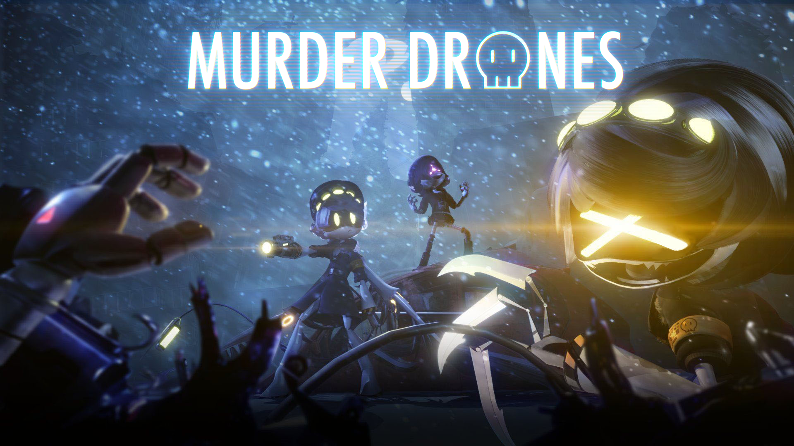

<p align="center">
  
</p>

# Murder Drones — Multimodal Timeline Dataset

A manually built and manually validated **Murder Drones multimodal dataset** containing timestamped dialogue, visual events, character presence, audio information, scene context, interpretation and audiovisual verification.

The project is designed as a reusable source for **machine learning, fine-tuning, multimodal research, video understanding, audiovisual analysis, transcript analysis and structured episode research**.


> [!NOTE]
> **Manually built and manually validated master dataset.** Designed as a reusable source for **fine-tuning, audiovisual analysis, structured episode research and text/Markdown representations of *Murder Drones*.**

> [!TIP]
> **Schema `v3.0`** · **186 events** · **Active: `S01E04 — Cabin Fever`** · **Current indexed endpoint: `11:15.968`**

## Development & release status

> [!IMPORTANT]
> **This dataset is still under active development and has not yet been released on GitHub.**
>
> The complete working dataset currently exists **only in the Hugging Face version**, where annotation, manual audiovisual validation and schema development continue.
>
> This GitHub repository currently serves as the **public project, documentation and dataset-preview repository**. The full dataset will be published here **only after the planned annotation work is complete and the dataset is ready for release**. Until then, the records shown below are examples of the current development format rather than a complete downloadable dataset.

## Dataset sample

The dataset is stored as structured JSONL records. The following two records are a small example from the current work-in-progress `S01E04` annotations:

```jsonl
{"schema_version":"3.0","record_id":"S01E04_evt_0041","start":"00:01:12.700","end":"00:01:15.660","event_type":"dialogue","event_subtype":"flashback_dialogue","speaker":"Khan","dialog":null,"dialog_candidate":"After the core collapse... I didn't notice the collars. Only your mom being a catch.","vocal_delivery":null,"observation":{"action":"Khan shows the photographs to Uzi, rotates one and gestures with finger-gun-like hand signs.","expression":{"Khan":"smiling, briefly winking"},"characters_on_screen":["Khan","Uzi"],"environment":null,"objects":[],"details":null},"audio":{"speech":null,"vocalization":[],"vehicle":null,"ambient":[],"offscreen":[]},"camera":{"transition":null,"framing":null,"movement":null,"angle":null},"visual_effects":{"screen_state":null,"shake":null,"glitch":null,"lighting":null,"peak_light":null},"interaction_target":null,"interpretation":{"temporal_layer":"flashback","function":null,"emotion":null},"confidence":{"dialog_timing":"medium","dialog_text":"high","identity":null,"dialog":"high","observation":null,"interpretation":null},"verification":{"status":"candidate_transcript_alignment","notes":null},"source":["manual_dataset3_part2"],"episode_id":"S01E04","asset_refs":[]}
{"schema_version":"3.0","record_id":"S01E04_evt_0042","start":"00:01:16.000","end":"00:01:18.000","event_type":"reaction","event_subtype":"reaction","speaker":null,"dialog":null,"dialog_candidate":null,"vocal_delivery":null,"observation":{"action":"Uzi listens.","expression":{"gaze":"toward Khan","eyes":"slightly narrowed","mouth":"neutral"},"characters_on_screen":["Uzi"],"environment":null,"objects":[],"details":null},"audio":{"speech":null,"vocalization":[],"vehicle":null,"ambient":[],"offscreen":[]},"camera":{"transition":null,"framing":null,"movement":null,"angle":null},"visual_effects":{"screen_state":null,"shake":null,"glitch":null,"lighting":null,"peak_light":null},"interaction_target":null,"interpretation":{"possible_emotion":"skeptical / suspicious","function":null,"emotion":"skeptical / suspicious"},"confidence":{"identity":null,"dialog":null,"observation":null,"interpretation":null},"verification":{"status":"manual_observed","notes":null},"source":["manual_dataset3_part2"],"episode_id":"S01E04","asset_refs":[]}
```

> [!NOTE]
> This sample reflects the **current development schema** and may still change before the final dataset release.

## Discoverability keywords

`Murder Drones` · `Murder Drones dataset` · `multimodal dataset` · `video dataset` · `video annotation` · `audiovisual dataset` · `dialogue dataset` · `timeline annotation` · `scene understanding` · `JSONL` · `machine learning` · `fine-tuning` · `computer vision` · `NLP`

Unlike most *Murder Drones* repositories centered on fan games, models, textures or character assets, this project focuses on **structured audiovisual annotation data** intended for machine-learning, research and downstream dataset-generation workflows.

### Suggested GitHub topics

```text
murder-drones
murder-drones-dataset
multimodal-dataset
video-annotation
audiovisual
jsonl
machine-learning
fine-tuning
dialogue-dataset
scene-understanding
computer-vision
nlp
```

## Dataset status

| Episodes | Active | Events | Dialogue events | Confirmed text | Candidates | Indexed words | Schema |
|---:|---|---:|---:|---:|---:|---:|---:|
| `1 / 8 started` | `S01E04` | **186** | **85** | **74** | **10** | **384** | `3.0` |

## Episodes

| Episode | Status | Episode | Status |
|---|---|---|---|
| `S01E01` | ⚪ Not started | `S01E05` | ⚪ Not started |
| `S01E02` | ⚪ Not started | `S01E06` | ⚪ Not started |
| `S01E03` | ⚪ Not started | `S01E07` | ⚪ Not started |
| **`S01E04 — Cabin Fever`** | 🟠 **In progress** | `S01E08` | ⚪ Not started |

`S01E01` → `S01E02` → `S01E03` → **`S01E04`** → `S01E05` → `S01E06` → `S01E07` → `S01E08`

---

<details>
<summary><strong>S01E04 — Cabin Fever</strong></summary>

| Indexed timeline | Events | Dialogue events | Confirmed text | Candidate text | Schema |
|---|---:|---:|---:|---:|---:|
| `00:00.000 → 11:15.968` | **186** | **85** | **74** | **10** | `3.0` |

> [!NOTE]
> The first indexed spoken text appears at **`00:33.800`** (`Hey!`), so the opening **33.8 seconds are almost entirely visual/ambient exposition**. Ronathon has a brief non-speech vocalization before that, but `audio.speech` remains false.

## Episode timeline

The table below is a **dataset-derived narrative segmentation**, not an official chapter list. It is meant to show what the current annotation actually covers and where coverage is sparse.

| Time | Length | Segment | Events | Text lines | What happens |
|---|---:|---|---:|---:|---|
| `00:00.000–00:53.600` | `00:53.600` | **Arrival & visual setup** | 34 | 1 | Camp reveal, bus arrival, students unloading, Uzi enters the camp. |
| `00:53.600–01:49.000` | `00:55.400` | **Uzi / Nori–Khan setup** | 15 | 5 | Uzi inspects the collars; photographs and Khan/Nori flashback material establish the mystery. |
| `01:49.000–02:06.833` | `00:17.833` | **Field-trip briefing** | 12 | 4 | Teacher and students establish the field-trip premise immediately before N and V arrive. |
| `02:06.833–03:24.000` | `01:17.167` | **N & V arrival / roll call** | 34 | 20 | N and V land, introduce the camp routine and interact with the students; Uzi's awkward social position is emphasized. |
| `03:24.000–04:45.184` | `01:21.184` | **Transition / sparse activity block** | 4 | 1 | The current records are comparatively sparse here; ambient/activity events bridge into Uzi's cabin sequence. |
| `04:45.184–05:07.904` | `00:22.720` | **Cabin scare** | 2 | 0 | Uzi explores alone; the dataset records a brief horror beat involving the hidden figure/hand and outside screams. |
| `05:07.904–06:38.225` | `01:30.321` | **Canoe activity + Uzi/V tension** | 35 | 21 | Camp activity on the frozen lake transitions into Uzi's overheating problem and a direct Uzi–V confrontation. |
| `06:38.225–08:18.864` | `01:40.639` | **Investigation / ambient transition** | 9 | 4 | A quieter, less completely verified block: bug/ambient events, an explosion, scanner sounds and discovery-oriented dialogue. |
| `08:18.864–09:44.992` | `01:26.128` | **Archery + Solver incident** | 24 | 14 | Archery activity escalates into Uzi's Solver reaction, V's fear response and Uzi fleeing the group. |
| `09:44.992–10:21.600` | `00:36.608` | **Sparse / transition interval** | 1 | 1 | Only one indexed event currently occupies this interval, so this is a clear candidate for denser annotation. |
| `10:21.600–11:15.969` | `00:54.369` | **N–V confrontation** | 16 | 13 | N confronts V about Uzi; their argument becomes the dominant focus of the currently annotated endpoint. |

### Timeline density

```text
00:00      00:54      01:49      02:07      03:24      04:45      05:08      06:38      08:19      09:45      10:22      11:16
│──────────│──────────│────│──────────────│────────────│────│────────────────│──────────────────│────────────────│───────│──────────│
 ARRIVAL     NORI/KHAN  BRIEF   N + V / ROLL   SPARSE      HORROR   CANOE + V/UZI   INVESTIGATION   ARCHERY/SOLVER   GAP    N ↔ V
```

> [!IMPORTANT]
> Sparse segments are useful information themselves. They show **where the dataset needs another manual pass**, rather than pretending the episode has uniform coverage.

## What the first 11 minutes look like

| Visual / narrative phase | Approx. share of indexed timeline | Notes |
|---|---:|---|
| Arrival & visual setup | **7.9%** | mostly visual |
| Uzi / Nori–Khan setup | **8.2%** | exposition |
| Field-trip briefing | **2.6%** | dialogue + setup |
| N & V arrival / roll call | **11.4%** | dialogue-heavy |
| Transition / sparse activity block | **12.0%** | sparse coverage |
| Cabin scare | **3.4%** | horror / observation |
| Canoe activity + Uzi/V tension | **13.4%** | dialogue + action |
| Investigation / ambient transition | **14.9%** | mixed / unverified |
| Archery + Solver incident | **12.7%** | action + dialogue |
| Sparse / transition interval | **5.4%** | coverage gap |
| N–V confrontation | **8.0%** | dialogue-heavy |

The largest single segment in the current segmentation is **Investigation / ambient transition**.  
The two clearest dialogue-heavy blocks are **N & V arrival / roll call** and the closing **N–V confrontation**.

---

## Speaking characters

```text
🟨 N                ██████████████████  23 lines ·  93 words
🟥 V                ███████████████░░░  19 lines ·  89 words
🟪 Uzi              ████████████░░░░░░  15 lines ·  68 words
🟦 female student   █████░░░░░░░░░░░░░   7 lines ·  30 words
🟫 Khan             ████░░░░░░░░░░░░░░   5 lines ·  50 words
🩷 Lizzy            ██░░░░░░░░░░░░░░░░   3 lines ·  12 words
🟩 Thad             ██░░░░░░░░░░░░░░░░   2 lines ·   9 words
🟧 Braiden          █░░░░░░░░░░░░░░░░░   1 lines ·   7 words
⬜ Teacher          █░░░░░░░░░░░░░░░░░   1 lines ·   5 words
🩵 Emily            █░░░░░░░░░░░░░░░░░   1 lines ·   1 words
⬛ Unknown          ███░░░░░░░░░░░░░░░   4 lines ·  12 words
```

| Speaker | Lines | Words | Speaker | Lines | Words |
|---|---:|---:|---|---:|---:|
| 🟨 **N** | 23 | 93 | 🟥 **V** | 19 | 89 |
| 🟪 **Uzi** | 15 | 68 | 🟦 **female student** | 7 | 30 |
| 🟫 **Khan** | 5 | 50 | 🩷 **Lizzy** | 3 | 12 |
| 🟩 **Thad** | 2 | 9 | 🟧 **Braiden** | 1 | 7 |
| ⬜ **Teacher** | 1 | 5 | 🩵 **Emily** | 1 | 1 |
| ⬛ **Unknown** | 4 | 12 |  |  |  |

> [!TIP]
> `dialog` and `dialog_candidate` remain separate in the raw records. The speaker chart above counts both when text is present, so it describes the **currently indexed speech material**, not only fully verified transcript text.

## Character presence

This measures how many event records explicitly list a named character in `characters_on_screen`; it is **not screen-time in seconds**.

```text
🟪 Uzi              ██████████████████  53 events
🟥 V                ████████████████░░  46 events
🟨 N                ███████████████░░░  44 events
▫️ Sam              █████░░░░░░░░░░░░░  14 events
🩵 Emily            ████░░░░░░░░░░░░░░  13 events
🟧 Braiden          ███░░░░░░░░░░░░░░░   9 events
⬜ Teacher          ███░░░░░░░░░░░░░░░   8 events
🟩 Thad             ███░░░░░░░░░░░░░░░   8 events
🩷 Lizzy            ███░░░░░░░░░░░░░░░   8 events
🟦 female student   ███░░░░░░░░░░░░░░░   8 events
```

## Event composition

| Dialogue | Observation | Action | Ambient | Visual | Reaction | Transition |
|---:|---:|---:|---:|---:|---:|---:|
| **85** | **41** | **26** | **17** | **7** | **7** | **3** |


## Comparison with the public transcript dataset

This dataset is intentionally built at a different level of detail than [`moelanoby/Murder-drones`](https://huggingface.co/datasets/moelanoby/Murder-drones). The public reference is primarily a transcript-style dataset; this repository treats the episode as a **multimodal timeline** containing speech, nonverbal vocal behavior, visual action, scene context and interpretation.

> [!IMPORTANT]
> The counts below are **not episode-completion scores**. This dataset currently covers only **`00:00.000 → 11:15.968`** of `S01E04`, while the comparison file covers the **entire episode 4**.

| Measure | This dataset — first `11:15.968` | `moelanoby/Murder-drones` — full episode 4 |
|---|---:|---:|
| Verbal lines containing spoken words | **84** | **136** |
| Pure nonverbal vocal entries | **12** | **51** |
| Mixed verbal + nonverbal entries | **6** | **30** |
| All records containing normalized nonverbal vocalization | **18** | n/a as a structured field |
| Structured nonverbal vocalization items | **24** | n/a as a structured field |

`Mixed verbal + nonverbal` is a **subset of verbal lines**, not an additional dialogue count. For example, a line containing spoken words plus a sigh, laugh, gasp or panting marker belongs to both the verbal category and the mixed category.

In this dataset, nonverbal behavior is normalized outside the dialogue string into structured `audio.vocalization` entries where the existing annotation supports it. The current first `11:15.968` contains **24 normalized vocalization items across 18 records**: **12 purely nonverbal records** and **6 records where spoken words coexist with a nonverbal vocal element**.

The comparison transcript instead stores this information inside its single `sentence` field, e.g. stage directions such as `[laughs]`, `[gasps]` or `[panting]`. Across its full `S01E04` file there are **187 transcript entries total**, of which **136 contain words**, **51 are purely nonverbal**, and **30 of the 136 verbal entries also contain a bracketed nonverbal marker**.

### Why manual audiovisual validation matters

The comparison dataset is useful as a transcript reference, but its speaker attribution cannot be accepted blindly. This dataset resolves disagreements by checking the **actual audiovisual sequence**: visible character presence, body/lip performance, continuity, scene context and audio.

| Timestamp | Dialogue | `moelanoby/Murder-drones` | This dataset after manual review |
|---|---|---|---|
| `00:02:46.999` | `Anything for my bestie.` | N | **Lizzy** |
| `00:03:19.960` | `This one's a pilot.` | Tessa | **V** |
| `00:05:18.380` | `Make way for the canoe train!` | N | **Thad** |
| `00:05:58.656` | `Tick-tock.` | Uzi | **V** |
| `00:06:02.330` | `H-Hey, stupid idiot...` | V | **Uzi** |
| `00:11:15.968` | `Do whatever you want.` | Lizzy | **V** |

These are examples of **speaker-attribution errors in the comparison transcript**, not stylistic rewrites.

The `Tessa` attribution at `00:03:19.960` is an especially useful sanity check: `This one's a pilot.` is delivered by **V** in the camp scene. Tessa is not participating in that conversation, so audiovisual continuity alone is enough to flag the transcript attribution for review.

> [!TIP]
> The goal is not to produce “a cleaner transcript.” The goal is to maintain a **master episode representation** that can be transformed downstream into transcript-only data, multimodal training examples, scene summaries, character/state analysis, Markdown representations or other fine-tuning formats.

## Verification state

### Verification terminology

The verification field mixes two different concepts:

- **manual review state** — whether the sequence was replayed and checked,
- **evidence strength** — whether a claim is directly visible/audible or reconstructed from surrounding context.

For this dataset, `source_only_unverified` belongs mostly to the second category. A clearer future schema name would be something like:

```text
scene_inference
offframe_inference
context_reconstruction
```

rather than `unverified`.


| Status | Records | Status | Records |
|---|---:|---|---:|
| `manual_observed` | **57** | `unannotated` | **1** |
| `manual_verified` | **1** | `candidate_transcript_alignment` | **10** |
| `manual_plus_dataset2_verified` | **2** | `source_only_unverified` | **89** |
| `manual_corrected` | **26** |  |  |

> [!NOTE]
> The `source_only_unverified` label is **not a “not checked” flag**.
>
> The `S01E04` source material used for this section was reviewed again after the records were saved. The annotation process was done in roughly minute-sized batches, then the relevant episode material was replayed and checked again as a continuous sequence.
>
> In practice, `source_only_unverified` marks records where the description extends beyond what can be directly confirmed from the visible frame alone — for example when reconstructing scene geometry, off-screen positioning, implied spatial relationships, or broader context from adjacent shots.
>
> So `89 / 186` does **not** mean “89 records were not manually reviewed.” It means those records contain scene-model or off-frame inferences that should be treated differently from directly observable frame-level facts.

---

## Interesting dataset observations

- **The opening is deliberately information-heavy without dialogue.** The first text-bearing spoken event does not appear until `00:33.800`.
- **N currently dominates indexed speech** by line count, with V and Uzi directly behind him.
- **Uzi is the most frequently indexed named on-screen character** in the current records.
- The dataset already exposes changes in storytelling mode: visual arrival → exposition/flashback → group dialogue → horror beat → camp activity → interpersonal tension → Solver escalation → N/V confrontation.
- There are visibly **uneven annotation-density zones**. This is useful for prioritizing where scene reconstruction is strongest or where another pass may be useful.
- `source_only_unverified` should be read as **inference-heavy / off-frame reconstruction**, not as “unchecked footage.”

---

## Annotation model

| Timeline & dialogue | Visual & interpretation |
|---|---|
| `start`, `end`, `event_type`, `event_subtype` | `observation`, `camera`, `visual_effects` |
| `speaker`, `dialog`, `dialog_candidate` | `interpretation`, `confidence` |
| `vocal_delivery`, `audio` | `verification`, `asset_refs`, `source` |

> [!TIP]
> Observation and interpretation are intentionally separated.  
> **Observed:** `Uzi looks toward Khan.`  
> **Interpreted:** `Uzi appears suspicious.`

## Assets

```text
assets/
├── banner.png
├── cover.png
└── S01E04/
    ├── preview.png
    └── keyframes/
```

Event-specific images can be linked through `asset_refs`.

---

## Rights & source material

> [!WARNING]
> This is an unofficial private annotation dataset and is not affiliated with or endorsed by the creators, distributors, or other rights holders of ***Murder Drones***.

The repository is primarily intended to contain independently produced annotation metadata. Original dialogue, animation, imagery, audio, video, screenshots, extracted frames, promotional artwork and other source material may be protected by copyright and should be reviewed separately before any public release.

---

</details>

## Repository structure

```text
Murder-Drones-Multimodal-Dataset/
├── README.md
├── LICENSE
├── CITATION.cff
├── metadata/
│   ├── episodes.json
│   ├── characters.json
│   └── schema.md
├── data/
│   ├── S01E01/
│   ├── S01E02/
│   ├── S01E03/
│   └── S01E04/
│       ├── metadata.json
│       └── events.jsonl
├── assets/
│   ├── banner.png
│   ├── cover.png
│   └── S01E04/
│       ├── preview.png
│       └── keyframes/
└── docs/
    ├── annotation-guidelines.md
    ├── schema.md
    └── known-ambiguities.md
```

## Naming conventions

- Project name in prose: **Murder Drones**
- Repository name: `Murder-Drones-Multimodal-Dataset`
- GitHub topic / slug style: `murder-drones`
- Episode identifiers: `S01E01` … `S01E08`
- Record identifiers: `S01E04_evt_0041`
- Episode asset directories: `assets/S01E04/`
- Documentation filenames: kebab-case, e.g. `annotation-guidelines.md`
- Dataset records: JSONL, e.g. `events.jsonl`

## GitHub metadata recommendation

**Repository description**

> Manually annotated multimodal Murder Drones dataset with timestamped dialogue, visual events, audio, character presence and audiovisual validation.

**Recommended repository name**

`Murder-Drones-Multimodal-Dataset`
